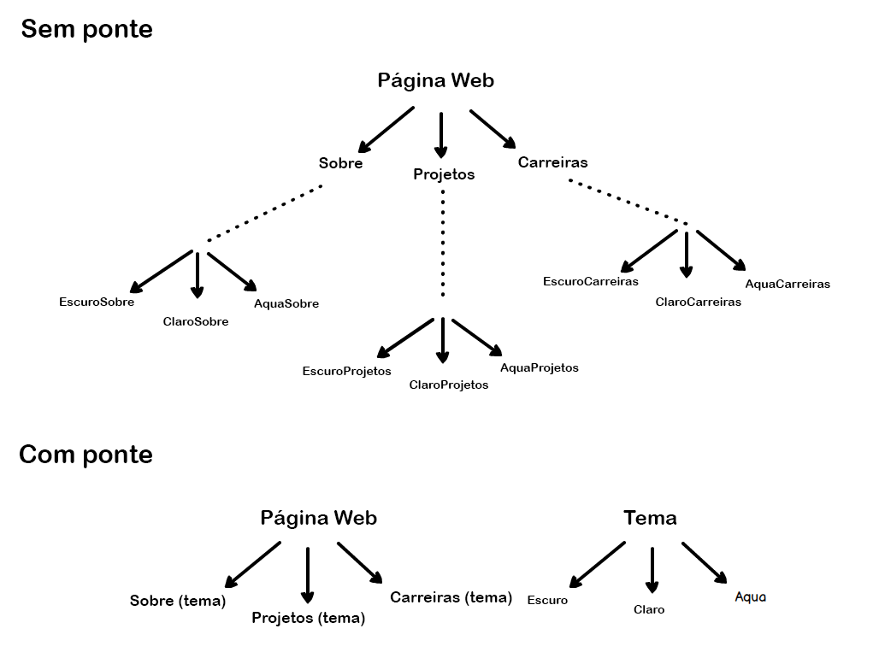

***
<p align="center">
🎉 Um guia ultra simplificado para padrões de projeto! 🎉
</p>
<p align="center">
Um tópico que pode confundir a mente de muita gente. Aqui eu tento fazer ele grudar na sua mente (e talvez na minha), explicando da forma <i>mais simples</i> possível.
</p>
***

❗ Notas de tradução
=================

- Alguns trechos de código foram traduzidos para que o entendimento seja melhor de acordo com o contexto inserido
- Algumas palavras são melhor definidas em sua língua original, portanto tais palavras **não** foram traduzidas. As mesmas terão um link de referência após para melhor entendimento
- O texto possui algumas alterações de sintaxe e estrutura para facilitar a tradução.

🚀 Introdução
=================

Padrões de projeto são soluções para problemas recorrentes. **Guias de como atacar certos problemas**. Eles não são classes, pacotes ou bibliotecas que você pode plugar na sua aplicação e esperar a mágica acontecer. Ao invés disso, eles são guias de como atacar certos problemas em situações específicas.

> Padrões de projeto são soluções para problemas recorrentes. Guias de como atacar certos problemas.

A Wikipédia os descreve como: 

> Em engenharia de software, um padrão de projeto de software é uma solução geral e reutilizável para um problema que costuma ser recorrente dentro de um contexto de design de software. Não é uma solução final que pode ser transformada diretamente em códigos fonte ou de máquina. É uma descrição, um molde de como resolver um problema que pode ser utilizado em diversas situações.

⚠️ Tenha cuidado!
-----------------
- Padrões de projeto **não** são uma bala de prata para todos os seus problemas.
- Não tente forçar o uso deles; coisas ruins acontecem quando esta regra é quebrada. Tenha em mente que padrões de projeto so soluções **para** problemas, não soluções **procurando** problemas; então não tente encaixar um padrão em todo lugar.
- Se usados de forma e maneira corretas, eles podem ser grandes salvadores; ou também podem resultar em uma bagunça absurda de código.

> Note também que os exemplos de código abaixo estão em PHP-7, no entanto isto não deve te atrapalhar porque os conceitos são os mesmos em qualquer lugar. Além do mais, **O suporte para outras linguagens no guia está em desenvolvimento**.

Tipos de padrões de projeto
-----------------

* [Criacional](#criacionais)
* [Estrutural](#estruturais)
* [Comportamental](#comportamentais)

<a name="criacionais"></a>Padrões de projeto criacionais
=================

Em palavras simples::
> Padrões criacionais são focados em como instanciar um objeto ou um grupo de objetos relacionados.

Wikipedia diz:
> Em engenharia de software, padrões de projeto criacionais são padrões de projeto que tratam dos mecanismos de criação de objetos, tentando criar objetos de forma adequada para a situação. A forma básica de criação de um objeto pode resultar em problemas de design ou adicionar complexidade ao mesmo. Estes padrões de projeto resolvem este problema controlando de alguma forma o modo como estes objetos são criados.

 * [Fábrica Simples](#fabrica-simples)
 * [Método Fábrica](#fabrica)
 * [Fábrica Abstrata](#fabrica-abstrata)
 * [Construtor](#construtor)
 * [Protótipo](#prototipo)
 * [Singleton](#singleton)

<a name="fabrica-simples"></a>🏠 Fábrica Simples
--------------
Exemplo no mundo real
> Considere isso, você está construindo uma casa e você precisa de portas. Seria uma bagunça se, toda vez que você precisasse de uma porta, você tivesse que colocar as suas roupas de marceneiro e começasse a esculpir uma porta na sua casa. Ao invés disso, você pode obte-la de uma fábrica.

Em palavras simples:
> A fábrica simples simplesmente gera uma instancia para o cliente sem expor nenhuma lógica de instanciação para o cliente.

Wikipedia diz
> Em programação orientada a objetos (POO), uma fábrica é um objeto que cria outros objetos - Formalmente, uma fábrica é uma função ou método que retorna objetos de um protótipo variável ou uma classe de alguma chamada de método, assumindo ser "new" <sup>[Keyword de programação]</sup>.

**Exemplo programático**

Primeiramente temos nossa interface "porta" e a implementação:
```php
interface Porta
{
    public function obterComprimento(): float;
    public function obterAltura(): float;
}

class PortaMadeira implements Porta
{
    protected $comprimento;
    protected $altura;

    public function __construct(float $comprimento, float $altura)
    {
        $this->comprimento = $comprimento;
        $this->altura = $altura;
    }

    public function obterComprimento(): float
    {
        return $this->comprimento;
    }

    public function obterAltura(): float
    {
        return $this->altura;
    }
}
```

Então temos a nossa fábrica de portas que cria uma porta e retorna ela para nós:
```php
class FabricaPorta
{
    public static function fazerPorta($comprimento, $altura): Porta
    {
        return new PortaMadeira($comprimento, $altura);
    }
}
```
Então pode ser usada como:
```php
$porta = FabricaPorta::fazerPorta(100, 200);
echo 'Comprimento: ' . $porta->obterComprimento();
echo 'Altura: ' . $porta->obterAltura();
```

**Quando usar?**

Quando criar um objeto não envolve apenas algumas alocações de variáveis, mas sim alguma lógica mais complexa. Faz mais sentido colocar toda essa lógica em uma fábrica dedicada ao invés de repetir o mesmo código em todos os lugares.

<a name="fabrica"></a>🏭 Método Fábrica
--------------

Exemplo do mundo real:
> Considere o caso de contratar um gerente. É impossível uma única pessoa entrevistar para cada posição. Então, baseado na vaga, ela tem que escolher e delegar os passos da entrevista para diferentes pessoas.

Em palavras simples:
> Provê um modo de delegar a lógica de instanciação para as classes filhas.

Wikipédia diz:
> Em programação baseada em classes, o padrão método fábrica é um padrão criacional que usa métodos-fábrica para lidar com o problema de criar objetos sem ter de especificar a exata classe do objeto que será criado. Isto é feito criando objetos através de chamadas para um método fábrica - que esteja especificado em uma interface e implementado pelas classes filhas, ou implementado na classe base e opcionalmente sobrescrito pelas suas classes derivadas - ao invés de chamar um construtor.

 **Exemplo programático**

Vamos pegar nosso exemplo de contratação de um gerente acima. Primeiramente temos um entrevistador, que é uma interface, e algumas implementações para ele:

```php
interface Entrevistador
{
    public function fazerPerguntas();
}

class Desenvolvedor implements Entrevistador
{
    public function fazerPerguntas()
    {
        echo 'Perguntando sobre padrões de projeto!';
    }
}

class ExecutivoComunitario implements Entrevistador
{
    public function fazerPerguntas()
    {
        echo 'Perguntando sobre comunidades';
    }
}
```

Agora vamos criar nosso `GerenteDeContratacao`

```php
abstract class GerenteDeContratacao
{

    // Método fábrica
    abstract public function criarEntrevistador(): Entrevistador;

    public function fazerEntrevista()
    {
        $entrevistador = $this->criarEntrevistador();
        $entrevistador->fazerPerguntas();
    }
}

```
Agora, qualquer classe filha vai poder estender esta classe e prover o entrevistador necessário.
```php
class GerenteDeDesenvolvimento extends GerenteDeContratacao
{
    public function criarEntrevistador(): Entrevistador
    {
        return new Desenvolvedor();
    }
}

class GerenteDeMarketing extends GerenteDeContratacao
{
    public function criarEntrevistador(): Entrevistador
    {
        return new ExecutivoComunitario();
    }
}
```
Então podemos usar como:

```php
$devManager = new GerenteDeDesenvolvimento();
$devManager->fazerEntrevista(); // Saída: Perguntando sobre padrões de projeto!

$marketingManager = new GerenteDeMarketing();
$marketingManager->fazerEntrevista(); // Saída: Perguntando sobre comunidade.
```

**Quando usar?**

Útil quando existe um processamento genérico em uma classe, mas a subclasse necessária é decidida dinamicamente em tempo de execução. Ou, em outras palavras, quando o cliente não sabe exatamente qual subclasse ele pode precisar.

<a name="fabrica-abstrata"></a>🔨 Fábrica Abstrata
----------------

Exemplo do mundo real:
> Estendendo nosso examplo com a porta na Fábrica Simples. Baseado em suas necessidades você pode precisar de uma porta de madeira de uma loja de portas de madeira, uma porta de ferro de uma loja de portas de ferro ou uma porta de plástico da loja relevante. Além disso você vai precisar de um cara com diferentes especialidades para encaxar essa porta no lugar, por exemplo, uma porta de madeira vai precisar de um marceneiro, enquanto uma porta de ferro vai precisar de um soldador. Como você pode ver, existe uma dependência entre as portas agora, a porta de madeira precisa de um amrceneiro, a de ferro de um soldador e etc.

Em palavras simples:
> Uma fábrica de fábricas; uma fábrica que agrupa fábricas individuais, mas dependentes, juntas sem especificar suas classes concretas.

Wikipédia diz:
> O padrão de fábrica abstrata provê uma maneira de encapsular um grupo de fábricas individuais que tem um tema comum, sem especificar suas classes concretas.

**Exemplo programático**

Traduzindo nosso exemplo com a porta acima. Vamos, primeiramente, criar nossa interface `Porta`, e criar uma implementação dela.

```php
interface Porta
{
    public function obterDescricao();
}

class PortaMadeira implements Door
{
    public function obterDescricao()
    {
        echo 'Eu sou uma porta de madeira';
    }
}

class PortaFerro implements Porta
{
    public function obterDescricao()
    {
        echo 'Eu sou uma porta de ferro';
    }
}
```
Agora temos nossos experts em encaixe:

```php
interface ExpertEncaixePorta
{
    public function obterDescricao();
}

class Soldador implements ExpertEncaixePorta
{
    public function obterDescricao()
    {
        echo 'Eu só instalo portas de ferro';
    }
}

class Marceneiro implements ExpertEncaixePorta
{
    public function obterDescricao()
    {
        echo 'Eu só instalo portas de madeira';
    }
}
```
Agora, nossa fábrica abstrata vai permitir que façamos uma familia de objetos relacionados, por exemplo, uma fábrica de portas de madeira vai criar uma porta de madeira e também um marceneiro, assim como a fábrica de portas de ferro vai criar uma porta de ferro e um soldador.

```php
interface FabricaPortas
{
    public function fazerPorta(): Door;
    public function fazerExpertInstalacao(): ExpertEncaixePorta;
}

// Fábrica de madeira para retornar uma porta de madeira e um marceneiro
class FabricaPortasMadeira implements FabricaPortas
{
    public function fazerPorta(): Porta
    {
        return new PortaMadeira();
    }

    public function fazerExpertInstalacao(): ExpertEncaixePorta
    {
        return new Marceneiro();
    }
}

// Uma fábrica de portas de ferro para retornar os objetos relevantes à portas de ferro
class FabricaPortasFerro implements FabricaPortas
{
    public function fazerPorta(): Porta
    {
        return new PortaFerro();
    }

    public function fazerExpertInstalacao(): ExpertEncaixePorta
    {
        return new Soldador();
    }
}
```
E podemos usar assim:
```php
$fabricaMadeira = new FabricaPortasMadeira();

$porta = $fabricaMadeira->fazerPorta();
$expert = $fabricaMadeira->fazerExpertInstalacao();

$porta->obterDescricao();  // Saída: Eu sou uma porta de madeira
$expert->obterDescricao(); // Saída: Eu só instalo portas de madeira

// O mesmo para a porta de ferro
$fabricaFerro = new FabricaPortasFerro();

$porta = $fabricaFerro->fazerPorta();
$expert = $fabricaFerro->fazerExpertInstalacao();

$porta->obterDescricao();  // Saída: Eu sou uma porta de ferro
$expert->obterDescricao(); // Saída: Eu só instalo portas de ferro
```

Como você pode ver, a fábrica de portas de madeira encapsulou o `marceneiro` e a `porta de madeira`, assim como a fábrica de portas de ferro encapsulou a `porta de ferro` e o `soldador`. E, logo, nos ajudou a criar uma regra de que, para cada fábrica, vamos ter sempre as portas e os experts corretos, ou seja, temos certeza de que para cada porta criada, nunca teremos o profissional de instalação errado.

**Quando usar?**

Quando existem dependências inter-relacionadas com uma lógica não muito simples de criação envolvida.

<a name="construtor"></a>👷 Construtor
--------------------------------------------
Exemplo do mundo real:
> Imagine que você está no McDonald's e pede um combo especial, digamos um "Big Mac", e eles te entregam sem *nenhum tipo de questionamento*; Isto é o exemplo da fábrica simples. Mas existem casos que a lógica de criação pode envolver mais passos. Por exemplo, imagine agora que você está no Subway e quer um lanche especialmente feito por você, você tem diversas opções para escolher, por exemplo, com queijo? Com tomate? Quente? Frio? Tipo de pão e etc. Neste caso temos que usar o modelo construtor.

Em palavras simples:
> Permite que você crie diferentes tipos de um objeto enquanto evita poluição no construtor do mesmo. É bastante útil quando um objeto tem diversos "sabores", ou seja, diversas implementações diferentes. Ou quando existem muitos passos envolvidos na criação de um objeto.

Wikipédia diz:
> O padrão construtor é um padrão de projeto criacional de design de software com a intenção de encontrar uma solução para o anti-padrão chamado de construtor telescópico.

Tendo dito isso, vamos explicar um pouco mais o que é o *construtor telescópico*. Em algum momento das nossas vidas como programadores vimos algo assim:

```php
public function __construct($tamanho, $queijo = true, $pepperoni = true, $tomate = false, $alface = true)
{
}
```

Como você pode ver, o número de parâmetros que o construtor leva pode rápidamente sair do controle e ficar complicado de entender o seu arranjo. Além disso, a lista de parâmetros pode continuar a crescer se você decidir adicionar mais opções no futuro. Isto é conhecido por ser um *anti-padrão* <sup>O inverso de padrão de projeto</sup> chamado `construtor telescópico`.

**Exemplo programático**

Usando nosso exemplo acima. A alternativa mais sã é usar o padrão construtor. PRimeiramente temos o nosso lanche:

```php
class Lanche
{
    protected $tamanho;

    protected $queijo = false;
    protected $pepperoni = false;
    protected $alface = false;
    protected $tomate = false;

    public function __construct(ConstrutorLanche $construtor)
    {
        $this->tamanho = $construtor->tamanho;
        $this->queijo = $construtor->queijo;
        $this->pepperoni = $construtor->pepperoni;
        $this->alface = $construtor->alface;
        $this->tomate = $construtor->tomate;
    }
}
```

E agora nosso construtor:

```php
class CosntrutorLanche
{
    public $tamanho;

    public $queijo = false;
    public $pepperoni = false;
    public $alface = false;
    public $tomate = false;

    public function __construct(int $tamanho)
    {
        $this->tamanho = $tamanho;
    }

    public function adicionarPepperoni()
    {
        $this->pepperoni = true;
        return $this;
    }

    public function adicionarAlface()
    {
        $this->alface = true;
        return $this;
    }

    public function adicionarQueijo()
    {
        $this->queijo = true;
        return $this;
    }

    public function adicionarTomate()
    {
        $this->tomate = true;
        return $this;
    }

    public function montar(): Lanche
    {
        return new Lanche($this);
    }
}
```

Podemos jutar tudo em:

```php
$lanche = (new ConstrutorLanche(14))
                    ->adicionarPepperoni()
                    ->adicionarAlface()
                    ->adicionarTomate()
                    ->montar();
```

**Quando usar?**

Quando um objeto pode ter diversos "sabores" e para evitar o anti-padrão de construtor telescópico. A diferença principal entre o construtor e a fábrica é que:

- A fábrica deve ser usada quando o processo de criação tem apenas um passo.
- O construtor é justamente o oposto, ele funciona muito melhor quando o processo de criação é composto de vários passos.

<a name="prototipo"></a>🐑 Protótipo
------------
Exemplo do mundo real:
> Lembra da Dolly? Aquela ovelha que foi clonada? Não vamos entrar nos detalhes aqui, mas o ponto chave é que isso é tudo sobre clonagem.

Em palavras simples:
> Cria um objeto baseado em outro através da clonagem

Wikipédia diz:
> O padrão protótipo é um padrão de projeto criacional em desenvolvimento de software. É usado quando o tipo dos objetos a serem criados é determinado por uma instancia modelo, ou protótipo, que é clonada para produzir novos objetos.

In suma, permite que você crie uma cópia de um objeto existente e modifique-o de acordo com suas necessidades. Ao invés de ter todo o problema de criar um objeto novo do zero e configurá-lo.

**Exemplo programático**

Em PHP, isso pode ser facilmente feito com o  `clone`

```php
class Ovelha
{
    protected $nome;
    protected $categoria;

    public function __construct(string $nome, string $categoria = 'Ovelha da montanha')
    {
        $this->nome = $nome;
        $this->categoria = $categoria;
    }

    public function setNome(string $nome)
    {
        $this->nome = $nome;
    }

    public function getNome()
    {
        return $this->nome;
    }

    public function setCategoria(string $categoria)
    {
        $this->categoria = $categoria;
    }

    public function getCategoria()
    {
        return $this->categoria;
    }
}
```
Então podemos clonar como abaixo:
```php
$original = new Ovelha('Jolly');
echo $original->getNome(); // Jolly
echo $original->getCategoria(); // Ovelha da montanha

// Clonamos e modificamos o que for necessário
$clone = clone $original;
$clone->setNome('Dolly');
echo $clone->getNome(); // Dolly
echo $clone->getCategoria(); // Ovelha da montanha
```

Você pode também usar o *magic method* `__clone` para modificar o comportamento da clonagem.

**Quando usar?**

Quando o objeto necessário é similar ao objeto já existente ou quando a criação seria muito cara comparada com a clonagem.

<a name="singleton"></a>💍 Singleton
------------
Exemplo do mundo real:
> Um país só pode ter um presidente por vez. O mesmo presidente deve ser chamado sempre que o dever chama. O presidente aqui é o singleton.

Em palavras simples:
> Certifica-se de que somente uma única instancia do objeto é criada **sempre**

Wikipédia diz:
> Em engenharia de software, o padrão singleton é um padrão de design de software que restringe a instanciação de uma classe a um unico objeto. É útil quando exatamente um objeto é necessário para coordenar ações através do sistema.

O padrão singleton é, na verdade, considerado um anti-padrão, logo o uso excessivo dele deve ser evitado. Ele não é necessariamente ruim e pode até ter alguns casos de uso válidos, mas ainda sim deve ser utilizado com cuidado porque introduz um estado global na aplicação, e a alteração deste estado em um lugar pode afetar outras áreas da mesma. Isso torna o o código muito difícil de debugar. O outro problema com o singleton é que ele torna seu código muito fortemente acoplado, além disso, criar um *mock*<sup>[modelo de testes]</sup> pode ser um pouco difícil.

**Exemplo programático**

Para criar um singleton, faça com que o construtor seja privado, desative a clonagem, desative a extensão e crie uma variável estática que vai armazenar a instância existente.

```php
final class Presidente
{
    private static $instancia;

    private function __construct()
    {
        // Esconda o construtor
    }

    public static function obterInstancia(): Presidente
    {
        if (!self::$instancia) {
            self::$instancia = new self();
        }

        return self::$instancia;
    }

    private function __clone()
    {
        // Desative a clonagem
    }

    private function __wakeup()
    {
        // Desative a desserialização
    }
}
```

Então podemos usar:

```php
$presidente1 = Presidente::obterInstancia();
$presidente2 = Presidente::obterInstancia();

var_dump($presidente1 === $presidente2); // true
```

<a name="estruturais"></a>Padrões de projeto estruturais
==========================

Em palavras simples:

> Padrões estruturais estão mais preocupados com a composição dos objetos, ou seja, como as entidades podem usar umas as outras. O até outra explicação poderia ser: Eles resolvem a pergunta de "como construir um componente de software?"

Wikipédia diz:

> Em engenharia de software, padrões de projeto estruturais são padrões de projeto que facilitam o design de um sistema identificando maneiras simples de criar relações entre entidades.

 * [Adaptador](#adaptador)
 * [Ponte](#ponte)
 * [Composição](#composicao)
 * [Decorador](#decorador)
 * [Fachada](#fachada)
 * [Flyweight](#-flyweight)
 * [Proxy](#-proxy)

<a name="adaptador"></a>🔌 Adaptador
-------

Exemplo do mundo real:

>Considere que você tem algumas imagens no seu cartão de memória e você precisa transferir elas para seu computador. Para fazer isso você vai precisar de algum tipo de adaptador que é compatível com a porta de entrada do seu computador para que você possa ligar o seu cartão de memória a ele. Neste caso, o leitor de cartão é um adaptdador.

> Um outro exemplo seria o famoso adaptador de tomadas. Uma tomada de três plugs não pode ser conectada, por exemplo, a uma saída de dois plugs, para isto é necessário utilizar um adaptador de tomadas que transforma o conector de três pontas em um conector de duas pontas.

>Mais um exemplo ainda, seria um tradutor traduzindo palavras em uma lingua para outra entre duas pessoas de nacionalidades diferentes.

Em palavras simples:

> Um adaptador permite que você encapsule objetos que seriam incompatíveis em um adaptador comum, de forma que eles possam se comunicar.

Wikipédia diz:

> Em engenharia de software, o padrão adaptador é um padrão de projetos de design que permite que uma classe de uma classe existente seja usada como outra interface. É comumente utilizada para fazer com que classes existentes se conectem com outras classes novas sem modificar seu código fonte.

**Exemplo programático**

Imagine um jogo, aonde temos um caçador, e este caçador caça leões.

Primeiramente temos a interface `Leão` que todos os tipos de leões devem implementar.

```php
interface Leao
{
    public function rugir();
}

class LeaoAfricano implements Leao
{
    public function rugir()
    {
    }
}

class LeaoAsiatico implements Leao
{
    public function rugir()
    {
    }
}
```

E então o caçador vai esperar qualquer tipo de interface de `Leao` para poder caçar.

```php
class Cacador
{
    public function cacar(Leao $leao)
    {
    }
}
```

Agora, imagine que vamos precisar adicionar um outro animal ao nosso jogo, digamos, um `CachorroSelvagem`, de forma que o caçador possa também caça-lo. Mas não podemos fazer isto diretamente porque o cachorro tem uma interface diferente. Para transformar em algo compatível com nosso caçador, vamos ter que criar uma adaptador.

```php
// Vamos precisar adicionar isso ao jogo
class CachorroSelvagem
{
    public function latir()
    {
    }
}

// Vamos criar um adaptador para o cachorro para transformar ele em algo compatível
class CachorroSelvagemAdaptador implements Leao
{
    protected $cachorro;

    public function __construct(CachorroSelvagem $cachorro)
    {
        $this->cachorro = $cachorro;
    }

    public function rugir()
    {
        //Note que sobrepomos a função rugir com o latido
        $this->cachorro->latir();
    }
}
```

Agora adicionamos o `CachorroSelvagem` no nosso jogo utilizando o `CachorroSelvagemAdaptador`

```php
$cachorroSelvagem = new CachorroSelvagem();
$cachorroSelvagemAdaptador = new CachorroSelvagemAdaptador($cachorroSelvagem);

$cacador = new Cacador();
$cacador->cacar($cachorroSelvagemAdaptador); //Implementa a interface Leao
```

<a name="ponte"></a>🚡 Ponte
------

Exemplo do mundo real:

> Considere que você tenha um site com diferentes paginas e você deve permitir que o usuário mude o tema destas páginas. O que você faria? Criaria multiplas cópias de cada página para cada tema existente ou simplesmente criaria um tema separado e carregaria ele como um módulo em cada página baseado nas preferências de usuário? O padrão ponte permite que você faça o segundo.



Em palavras simples

> O padrão ponte é sobre preferir a composição de objetos ao invés de herança. Detalhes de implementação são passados de uma hierarquia a outro objeto com uma hierarquia separada.

Wikipédia diz:

> O padrão ponte é um padrão de projetos utilizado em engenharia de software com o objetivo de "desacoplar uma abstratção de sua implementação, de forma que ambas possam variar independentemente".

**Exemplo programático**

Traduzindo nosso exemplo acima, aqui temos a nossa hierarquia para `PaginaWeb`:

```php
interface PaginaWeb
{
    public function __construct(Tema $tema);
    public function obterConteudo();
}

class Sobre implements PaginaWeb
{
    protected $tema;

    public function __construct(Tema $tema)
    {
        $this->tema = $tema;
    }

    public function obterConteudo()
    {
        return "Página sobre em " . $this->tema->obterCor();
    }
}

class Carreiras implements PaginaWeb
{
    protected $tema;

    public function __construct(Tema $tema)
    {
        $this->tema = $tema;
    }

    public function obterConteudo()
    {
        return "Página carreiras em " . $this->tema->obterCor();
    }
}
```
E ai temos nossa hierarquia separada para o tema:

```php

interface Tema
{
    public function obterCor();
}

class TemaEscuro implements Tema
{
    public function obterCor()
    {
        return 'Preto';
    }
}
class TemaClaro implements Tema
{
    public function obterCor()
    {
        return 'Branco';
    }
}
class TemaAqua implements Tema
{
    public function obterCor()
    {
        return 'Azul claro';
    }
}
```

Agora podemos juntar as duas herarquias

```php
$temaEscuro = new TemaEscuro();

$sobre = new Sobre($temaEscuro);
$carreiras = new Carreiras($temaEscuro);

echo $sobre->obterConteudo(); // "Página sobre em Preto";
echo $carreiras->obterConteudo(); // "Página carreiras em Preto";
```

<a name="composicao"></a>🌿 Composição
-----------------

Exemplo do mundo real:

> Toda organização é composta de funcionários. Cada funcionário tem as masmas características, por exemplo, um salário, algumas responsabilidades, podem ou não se reportar a alguém, podem ou não ter subordinados, etc.

Em palavras simples:

> O padrão de composição permite que os clientes tratem os objetos individuais de uma forma uniforme.

Wikipédia diz:

> Em engenharia de software, o padrão de composição é um padrão de projeto de particionamento. A composição descreve que um grupo de objetos deve ser tratado da mesma forma que uma instancia única de um objeto. A intenção de uma composição é "compor" objetos em estruturas de árvores para representar hierarquias. Implementar o padrão de composição permite que clientes tratem objetos individuais e composições uniformemente.

**Exemplo programático**

Usando o exemplo de funcionários acima. Vamos criar nossa interface de empregados:

```php
interface Funcionario
{
    public function __construct(string $nome, float $salario);
    public function obterNome(): string;
    public function setarSalario(float $salario);
    public function obterSalario(): float;
    public function obterCargo(): array;
}

class Deselvolvedor implements Funcionario
{
    protected $salario;
    protected $nome;

    public function __construct(string $nome, float $salario)
    {
        $this->nome = $nome;
        $this->salario = $salario;
    }

    public function obterNome(): string
    {
        return $this->nome;
    }

    public function setarSalario(float $salario)
    {
        $this->salario = $salario;
    }

    public function obterSalario(): float
    {
        return $this->salario;
    }

    public function obterCargo(): array
    {
        return $this->roles;
    }
}

class Designer implements Funcionario
{
    protected $salario;
    protected $nome;

    public function __construct(string $nome, float $salario)
    {
        $this->nome = $nome;
        $this->salario = $salario;
    }

    public function obterNome(): string
    {
        return $this->nome;
    }

    public function setarSalario(float $salario)
    {
        $this->salario = $salario;
    }

    public function obterSalario(): float
    {
        return $this->salario;
    }

    public function obterCargo(): array
    {
        return $this->roles;
    }
}
```

Então temos nossa organização, que possui uma série de empregados:

```php
class Organizacao
{
    protected $funcionarios;

    public function adicionarFuncionario(Funcionario $funcionario)
    {
        $this->funcionarios[] = $funcionario;
    }

    public function obterSalarios(): float
    {
        $salarioLiquido = 0;

        foreach ($this->funcionarios as $funcionario) {
            $salarioLiquido += $funcionario->obterSalario();
        }

        return $salarioLiquido;
    }
}
```

Então podemos usar assim:

```php
// Preparamos os desenvolvedores
$john = new Deselvolvedor('John Doe', 12000);
$jane = new Designer('Jane', 10000);

// Adicionamos a uma organização
$empresa = new Organization();
$empresa->adicionarFuncionario($john);
$empresa->adicionarFuncionario($jane);

echo "Salários liquidos: " . $empresa->obterSalarios(); // Salários liquidos: 22000
```

<a name="decorador"></a>☕ Decorador
-------------

Exemplo do mundo real:

> Imagine que você possui uma oficina mecânica, que oferece diversos tipos de serviços. Agora como você calcula o preço total da conta? Você pega um serviço e dinamicamente adiciona os preços dos serviços subsequentes até você ter o custo final. Neste caso, cada tipo de serviço é um decorador.

Em palavras simples:

> O padrão decorador permite que você dinamicamente altere o comportamento de um objeto em tempo de execução encapsulando todos em um objeto de decoração.

Wikipédia diz:

> Em programação orientada a objetos (POO), o padrão decorador é um padrão de projetos que permite que um comportamento seja adicionado a um objeto individual, tanto dinamica quanto estaticamente, sem afetar o comportamento de outros objetos da mesma classe. O decorador é bastante útil para aderir ao Princípio de Responsabilidade Única, pois permite que a funcionalidade seja dividida entre as classes com áreas de responsabilidade únicas.

**Exemplo programático**

Vamos imaginar um café. Primeiramente temos um café simples, implementando uma interface de café:

```php
interface Cafe
{
    public function obterCusto();
    public function obterDescricao();
}

class CafeSimples implements Cafe
{
    public function obterCusto()
    {
        return 10;
    }

    public function obterDescricao()
    {
        return 'Café simples';
    }
}
```

Queremos fazer com que este código seja estensível para permitir opções de modificações no café. Vamos fazer alguns add-ons (decoradores):

```php
class CafeComLeite implements Cafe
{
    protected $cafe;

    public function __construct(Cafe $cafe)
    {
        $this->cafe = $cafe;
    }

    public function obterCusto()
    {
        return $this->cafe->obterCusto() + 2;
    }

    public function obterDescricao()
    {
        return $this->cafe->obterDescricao() . ', leite';
    }
}

class CafeBatido implements Cafe
{
    protected $cafe;

    public function __construct(Cafe $cafe)
    {
        $this->cafe = $cafe;
    }

    public function obterCusto()
    {
        return $this->cafe->obterCusto() + 5;
    }

    public function obterDescricao()
    {
        return $this->cafe->obterDescricao() . ', batido';
    }
}

class CafeComBaunilha implements Cafe
{
    protected $cafe;

    public function __construct(Cafe $cafe)
    {
        $this->cafe = $cafe;
    }

    public function obterCusto()
    {
        return $this->cafe->obterCusto() + 3;
    }

    public function obterDescricao()
    {
        return $this->cafe->obterDescricao() . ', baunilha';
    }
}
```

Vamos fazer nosso café agora:

```php
$umCafe = new CafeSimples();
echo $umCafe->obterCusto(); // 10
echo $umCafe->obterDescricao(); // Café simples

$umCafe = new CafeComLeite($umCafe);
echo $umCafe->obterCusto(); // 12
echo $umCafe->obterDescricao(); // Café simples, leite

$umCafe = new CafeBatido($umCafe);
echo $umCafe->obterCusto(); // 17
echo $umCafe->obterDescricao(); // Café simples, leite, batido

$umCafe = new CafeComBaunilha($umCafe);
echo $umCafe->obterCusto(); // 20
echo $umCafe->obterDescricao(); // Café simples, leite, batido, baunilha
```

<a name="fachada"></a>📦 Fachada
----------------

Exemplo do mundo real:

> Como você liga seu computador? "Aperto o botão de ligar", você vai dizer, certo? Isto que você acredita porque você está usando uma interface simples que o computador provê do lado de fora, internamente ele precisa fazer muito mais coisas para isto acontecer. A interface simples para um subsistema complexo é a fachada.

Em palavras simples:

> O padrão de fachada provê uma interface simplificada para um subsistema complexo.

Wikipédia diz:

> A fachada é um objeto que provê uma interface simplificada para um corpo de código maior, como uma biblioteca.

**Exemplo programático**

Vamos usar nosso exemplo do computador. Primeiro, implementamos nossa interface do computador:

```php
class Computador
{
    public function levarChoque()
    {
        echo "Ouch!";
    }

    public function fazerSom()
    {
        echo "Beep beep!";
    }

    public function mostrarTelaLoading()
    {
        echo "Carregando...";
    }

    public function pronto()
    {
        echo "Pronto para usar!";
    }

    public function fecharTudo()
    {
        echo "Bup bup bup buzzzz!";
    }

    public function desligar()
    {
        echo "Zzzzz";
    }

    public function puxarCorrente()
    {
        echo "Haaah!";
    }
}
```

Here we have the facade

```php
class ComputadorFachada
{
    protected $computador;

    public function __construct(Computador $computador)
    {
        $this->computador = $computador;
    }

    public function ligar()
    {
        $this->computador->levarChoque();
        $this->computador->fazerSom();
        $this->computador->mostrarTelaLoading();
        $this->computador->pronto();
    }

    public function desligar()
    {
        $this->computador->fecharTudo();
        $this->computador->puxarCorrente();
        $this->computador->desligar();
    }
}
```
Now to use the facade
```php
$computador = new ComputadorFachada(new Computador());
$computador->ligar(); // Ouch! Beep beep! Carregando... Pronto para usar!
$computador->desligar(); // Bup bup buzzz! Haah! Zzzzz
```

🍃 Flyweight
---------

Exemplo do mundo real:

> Você já tomou algum chá gelado de algum quiosque? Eles sempre fazem mais do que uma taça e guardam o resto para qualquer outro cliente, então, para guardar recursos, por exemplo, gás, agua e etc. O padrão FlyWeight é somente sobre isso, compartilhamento.

Em palavras simples:

> É utilizado para minimizar o uso de memória ou recursos computacionais através de compartilhamento com outros objetos similares.

Wikipédia diz:

> Em programação de computadores, flyweight é um padrão de desenvolvimento de software. Um flyweight é um objeto que minimiza o uso de memória através do compartilhamento do máximo possível de dados com outros objetos similares; É uma forma de usar objetos em grandes números quando uma representação simples e repetitiva usaria uma quantidade de memória inaceitável.

**Exemplo programático**

Traduzindo o exemplo. Primeiramente temos nossas implementações do chá e do cozinheiro.

```php
// Qualquer coisa que for cacheada é um flyweight.
// Aqui, os tipos de chá serão os flyweights
class ChaKarak
{
}

// Age como uma fábrica, salva o chá
class Cozinheiro
{
    protected $chaDisponivel = [];

    public function fazer($preferencia)
    {
        if (empty($this->chaDisponivel[$preferencia])) {
            $this->chaDisponivel[$preferencia] = new ChaKarak();
        }

        return $this->chaDisponivel[$preferencia];
    }
}
```

Agora temos a nossa `LojaCha` que pega os pedidos e os serve.

```php
class LojaCha
{
    protected $pedidos;
    protected $cozinheiro;

    public function __construct(Cozinheiro $cozinheiro)
    {
        $this->cozinheiro = $cozinheiro;
    }

    public function pegarPedido(string $tipoCha, int $mesa)
    {
        $this->pedidos[$mesa] = $this->cozinheiro->fazer($tipoCha);
    }

    public function servir()
    {
        foreach ($this->pedidos as $mesa => $cha) {
            echo "Servindo chá para mesa #" . $mesa;
        }
    }
}
```
And it can be used as below

```php
$cozinheiro = new Cozinheiro();
$loja = new LojaCha($cozinheiro);

$loja->pegarPedido('menos açucar', 1);
$loja->pegarPedido('mais leite', 2);
$loja->pegarPedido('sem açucar', 5);

$loja->servir();
// Servindo chá para mesa #1
// Servindo chá para mesa #2
// Servindo chá para mesa #5
```

🎱 Proxy
-------------------

Exemplo do mundo real:

> Você já teve que usar um cartão de acesso para abrir alguma porta? Existem múltiplas opções para abrir aquela porta, por exemplo, um cartão de acesso ou então um botão que desativa a segurança. A principal funcionalidade da porta é abrir, mas existe um proxy adicionado sobre ela para criar funcionalidades adicionais. Vamos explicar melhor usando o exemplo abaixo.

Em palavras simples:

> Usando o padrão proxy, uma classe representa uma funcionalidade de outra classe.

Wikipédia diz:

> Um proxy, na sua forma mais geral, é uma classe funcionando com interface para alguma outra coisa. Um proxy é um encapsulamento ou um objeto agente que é chamado pelo cliente para acessar o objeto servidor real por baixo dos panos. Um uso do proxy pode ser simplesmente redirecionar para o objeto real, ou então prover lógicas extras. No proxy, novas funcionalidades podem ser implementadas, por exemplo, cache de operações quando as mesmas no objeto real são de custo intenso, ou então checar pré-condições antes de operações serem executadas em tais objetos.

**Exemplo programático**

Vamos utilizar nosso exemplo da porta acima, primeiramente implementamos a interface para uma porta:

```php
interface Porta
{
    public function abrir();
    public function fechar();
}

class PortaLaboratorio implements Porta
{
    public function abrir()
    {
        echo "Abrindo porta do laboratório";
    }

    public function fechar()
    {
        echo "Fechando porta do laboratório";
    }
}
```

Agora criamos um proxy para adicionar segurança a qualquer tipo de porta que quisermos: 

```php
class Seguranca
{
    protected $porta;

    public function __construct(Porta $porta)
    {
        $this->porta = $porta;
    }

    public function open($senha)
    {
        if ($this->autenticar($senha)) {
            $this->porta->abrir();
        } else {
            echo "Opa! Não é possível!";
        }
    }

    public function autenticar($senha)
    {
        return $senha === '$ecr@t';
    }

    public function fechar()
    {
        $this->porta->fechar();
    }
}
```

E aqui está o uso:

```php
$porta = new Seguranca(new PortaLaboratorio());
$porta->abrir('invalida'); // Opa! Não é possível!

$porta->abrir('$ecr@t'); // Abrindo porta do laboratório
$porta->fechar(); // Fechando porta do laboratório
```

Ainda, um novo exemplo seria algum tipo de implementação de mapeamento de dados. Por exemplo, recentemente fiz um ODM (Object Data Mapper) para MongoDB usando este padrão, onde escrevi um proxy ao redor das classes do mongo enquanto utilizava o _magic method_ `__call()`. Todas as chamadas de métodos eram roteadas para a classe original do mongo e o resultado era retornado da forma original, mas no caso do uso da função `find` ou `findOne`, o dado era mapeado para a classe requerida e o objeto era retornado ao invés de um `Cursor`.

<a name="comportamentais"></a>Padrões de projeto comportamentais
==========================

Em palavras simples:

> Estão preocupados com a delegação de responsabilidades entre os objetos. O que torna esta caregoria diferente dos estruturais é que eles não só especificam a estrutura, mas também as regras e padrões de comunicação entre os objetos. Em outras palavras, eles ajudam a responder a pergunta: "Como executar um comportamento em um componente de software?".

Wikipédia diz:

> Em Engenharia de Software, padrões de projeto comportamentais são modelos de projeto que identificam padrões de comunicações comuns entre objetos. Desta forma, este tipo de padrões aumentam a flexibilidade e facilidade desta comunicação acontecer.

* [Cadeia de Responsabilidade](#cadeia)
* [Comando](#comando)
* [Iterador](#iterador)
* [Mediador](#mediador)
* [Memento](#-memento)
* [Observador](#observador)
* [Visitante](#visitante)
* [Estratégia](#estrategia)
* [Estado](#estado)
* [Método Modelo](#template)

<a name="cadeia"></a>🔗 Cadeia de Responsabilidade
-----------------------

Exemplo do mundo real:

> Por exemplo, você tem três meios de pagamento (`A`, `B` e `C`) já cadastrados em sua conta em algum site. Cada um deles possui uma quantidade de dinheiro. O `A` tem R$100,00, `B` possui R$300,00 e o `C` tem R$1000,00, e a preferência de pagamento sempre segue: Primeiro `A`, depois `B` e então `C`. Você tenta comprar alguma coisa que vale R$210,00. Usando a Cadeia de Responsabilidade, primeiramente a conta `A` será verificada para saber se possui valor suficiente para fazer a compra, se sim, então a compra será feita e a cadeia quebrada. Se não, a requisição irá para frente para a conta `B`, checando a quantidade novamente, se sim, a cadeia será quebrada, caso contrário a requisição continuará se movendo para frente até que encontre uma conta aceitável. Aqui `A`, `B` e `C` são elos da cadeia, e o fenômeno todo é a cadeia de responsabilidade.

Em palavras simples:

> Ajuda a construir uma cadeia de objetos. A requisição entra por um lado e continua de objeto a objeto até chegar em um objeto aceitável.

Wikipédia diz:

> Em design orientado à objetos, o padrão da cadeia de responsabilidade é um padrão de projetos que consiste em uma sequência de objetos de origem e uma sequência de objetos de processamento. Cada objeto de processamento contém a lógica que define que tipos de comando o objeto em questão pode lidar. O resto é passado para o objeto de processamento seguinte na cadeia.

**Exemplo programático**

Vamos traduzir nosso exemplo com as contas, primeiramente temos a nossa conta base:

```php
abstract class Conta
{
    protected $successor;
    protected $saldo;

    public function setarProximo(Conta $conta)
    {
        $this->successor = $conta;
    }

    public function pagar(float $quantidadeAPagar)
    {
        if ($this->podePagar($quantidadeAPagar)) {
            echo sprintf('Pago %s usando %s' . PHP_EOL, $quantidadeAPagar, get_called_class());
        } elseif ($this->successor) {
            echo sprintf('Não é possível pagar usando %s. Continuando ...' . PHP_EOL, get_called_class());
            $this->successor->pagar($quantidadeAPagar);
        } else {
            throw new Exception('Nenhuma das contas tem saldo suficiente');
        }
    }

    public function podePagar($quantia): bool
    {
        return $this->saldo >= $quantia;
    }
}

class Banco extends Conta
{
    protected $saldo;

    public function __construct(float $saldo)
    {
        $this->saldo = $saldo;
    }
}

class Paypal extends Conta
{
    protected $saldo;

    public function __construct(float $saldo)
    {
        $this->saldo = $saldo;
    }
}

class Bitcoin extends Conta
{
    protected $saldo;

    public function __construct(float $saldo)
    {
        $this->saldo = $saldo;
    }
}
```

Vamos preparar a cadeia seguindo a ordem acima (Ex: Bank, Paypal, Bitcoin)

```php
// A ordem da cadeia será igual a abaixo
//      $banco->$paypal->$bitcoin
//
// Primeiramente o banco
//      Se o banco não puder pagar, então paypal
//        Se o paypal não puder então o BitCoin

$banco = new Banco(100);          // Banco com saldo 100
$paypal = new Paypal(200);      // Paypal com saldo 200
$bitcoin = new Bitcoin(300);    // Bitcoin com saldo 300

$banco->setarProximo($paypal);
$paypal->setarProximo($bitcoin);

// Vamos tentar pagar usando a primeira prioridade da lista, o banco
$banco->pagar(259);

// A saída vai ser
// ==============
// Não é possível pagar usando o banco. Continuando ...:
// Não é possível pagar usando PayPal. Continuando...:
// Pago 259 usando BitCoin
```

<a name="comando"></a>👮 Comando
-------

Exemplo do mundo real:

> Um exemplo bem genérico seria pedir comida em um restaurante. Você (`Cliente`) pede ao garçom (`Invocador`) para trazer comida (`Comando`) e o garçom simplesmente passa a requisição a diante para o chef (`Receptor`) que possui o conhecimento de como e o que cozinhar.

> Outro exemplo seria você (`Cliente`) trocando de canais (`Comando`) na televisão (`Receptor`) usando o controle remoto (`Invocador`).

Em palavras simples:

> Permite que você encapsule ações em objetos. A ideia chave por trás deste padrão e prover uma maneira de desacoplar o cliente do receptor.

Wikipédia diz:

> Em POO, o padrão comando é um padrão de projetos comportamental no qual um objeto é usado para encapsular toda a informação necessárias para executar uma ação ou acionar um evento mais adiante no fluxo de execução. Estas informações incluem o nome do método, o objeto que é dono deste método e os valores para os parâmetros do métoso.

**Exemplo programático**

Primeiramente temos o nosso receptor, que tem a implementação de todas as ações que podem ser executadas:

```php
// Receptor
class Luz
{
    public function ligar()
    {
        echo "Luz foi ligada";
    }

    public function desligar()
    {
        echo "Escuridão!";
    }
}
```

Depois temos a interface que cada comando vai implementar e então o conjunto de comandos:

```php
interface Commando
{
    public function executar();
    public function desfazer();
    public function refazer();
}

// Commando
class Ligar implements Commando
{
    protected $luz;

    public function __construct(Luz $luz)
    {
        $this->luz = $luz;
    }

    public function executar()
    {
        $this->luz->ligar();
    }

    public function desfazer()
    {
        $this->luz->desligar();
    }

    public function refazer()
    {
        $this->executar();
    }
}

class Desligar implements Commando
{
    protected $luz;

    public function __construct(Luz $luz)
    {
        $this->luz = $luz;
    }

    public function executar()
    {
        $this->luz->desligar();
    }

    public function desfazer()
    {
        $this->luz->ligar();
    }

    public function refazer()
    {
        $this->executar();
    }
}
```

Então temos o `Invocador`, com quem o cliente vai interagir para executar quaisquer comandos.

```php
// Invocador
class ControleRemoto
{
    public function enviar(Comando $comando)
    {
        $comando->executar();
    }
}
```

Agora podemos usar assim:

```php
$luz = new Luz();

$ligar = new Ligar($luz);
$desligar = new Desligar($luz);

$remote = new ControleRemoto();
$remote->enviar($ligar); // A Luz foi acessa
$remote->enviar($desligar); // Escuridão!
```

O padrão comando também é usado para implementar sistemas baseados em transações. Aonde você mantém um histórico de comandos que foram executados a medida que você os roda. Se o comando final for executado com sucesso, então está tudo ok, mas caso um dos comandos dê errado, então basta iterar pelo histórico executando o método `desfazer` em cada comando executado.

Outra aplicação do padrão comando é para sistemas aonde você possui plugins ou comandos externos que podem ser criados pelos usuários do sistema. Por exemplo, imagine que você possua um sistema de controle remoto de determinada plataforma, existem várias ações que o usuário pode executar, e outras ações podem ser adicionadas no futuro. Desta forma é necessário ter uma aplicação cliente que envia o nome da ação e seus parâmetros para o `invocador`, que é uma classe presente juntamente com a plataforma que será controlada, desta forma este invocador pode instanciar o comando enviado e executar qualquer lógica interna, retornando o resultado para o `cliente` no final do processo. Caso seja necessário adicionar uma nova ação, basta que um novo arquivo seja criado implementando a interface de comandos. Note que neste modelo, não é necessário implementar as funções para histórico transacional.

<a name="iterador"></a>➿ Iterador
--------

Exemplo do mundo real:

> Um rádio antigo é um ótimo exemplo de iterador, onde o usuário pode começar em alguma estação e usar os botões "próximo" ou "anterior" para avançar ou voltar as respectivas estações. Ou também o exemplo de um MP3 Player ou uma TV aonde você pode utilizar os mesmos botões para avançar ou voltar os canais ou músicas consecutivas. Em outras palavras, todos eles provêm interfaces para iterar através dos canais. 

Em palavras simples:

> Apresenta uma maneira de acessar elementos de um objeto sem expor a apresentação interna do mesmo.

Wikipédia diz:

> Em POO, o padrão iterador é um padrão de projeto no qual um iterador é usado para transpor um container e acessar seus elementos. Este padrão desacopla os algoritmos de seus containers; em alguns casos, os algoritmos são específicos dos containers e, portanto, não podem ser desacoplados.

**Exemplo programático**

No PHP isso é muito simples de fazer usando a SPL (Standard PHP Library). Traduzindo nosso exemplo com rádio. Primeiramente temos nossa classe de `EstacaoRadio`:

```php
class EstacaoRadio
{
    protected $frequencia;

    public function __construct(float $frequencia)
    {
        $this->frequencia = $frequencia;
    }

    public function obterFrequencia(): float
    {
        return $this->frequencia;
    }
}
```

Então temos nosso iterador:

```php
use Countable;
use Iterator;

class ListaEstacoes implements Countable, Iterator
{
    /** @var EstacaoRadio[] $estacoes */
    protected $estacoes = [];

    /** @var int $counter */
    protected $counter;

    public function adicionarEstacao(EstacaoRadio $estacao)
    {
        $this->estacoes[] = $estacao;
    }

    public function removerEstacao(EstacaoRadio $aRemover)
    {
        $aRemoverFrequencia = $aRemover->obterFrequencia();
        $this->estacoes = array_filter($this->estacoes, function (EstacaoRadio $estacao) use ($aRemoverFrequencia) {
            return $estacao->obterFrequencia() !== $aRemoverFrequencia;
        });
    }

    public function count(): int
    {
        return count($this->estacoes);
    }

    public function current(): EstacaoRadio
    {
        return $this->estacoes[$this->counter];
    }

    public function key()
    {
        return $this->counter;
    }

    public function next()
    {
        $this->counter++;
    }

    public function rewind()
    {
        $this->counter = 0;
    }

    public function valid(): bool
    {
        return isset($this->estacoes[$this->counter]);
    }
}
```

Então usamos como:

```php
$listaEstacoes = new ListaEstacoes();

$listaEstacoes->adicionarEstacao(new EstacaoRadio(89));
$listaEstacoes->adicionarEstacao(new EstacaoRadio(101));
$listaEstacoes->adicionarEstacao(new EstacaoRadio(102));
$listaEstacoes->adicionarEstacao(new EstacaoRadio(103.2));

foreach($listaEstacoes as $estacao) {
    echo $estacao->obterFrequencia() . PHP_EOL;
}

$listaEstacoes->removerEstacao(new EstacaoRadio(89)); // Vai remover a estação 89
```

<a name="mediador"></a>👽 Mediador
========

Exemplo do mundo real:

> Um exemplo geral seria quando você conversa com alguém no seu celular, existe um provedor de rede entre você e a pessoa, e sua conversa passa por este provedor ao invés de ser enviada diretamente. Neste caso, o provedor de rede é o mediador.

Em palavras simples:

> O padrão mediador adiciona um objeto terceiro (chamado de mediador) para controlar a interação entre dois objetos (chamados de colegas). Ajuda a reduzir o acoplamento entre as partes que se comunicam entre si, pois cada uma não precisa ter o conhecimento da implementação da outra.

Wikipédia diz:

> Em engenharia de software, o padrão mediador define um objeto que encapsula como uma série de objetos deve interagir. Este padrão é considerado como um padrão comportamental devido ao modo como ele pode alterar o comportamento de execução do programa.

**Exemplo programático**

Aqui está o exemplo mais simples possível de uma sala de chat (mediador) e seus usuáriso (colegas) enviando mensagens um ao outro.

Primeiramento temos nosso mediador:

```php
interface MediadorSalaChat 
{
    public function showMessage(User $usuario, string $message);
}

// Mediator
class ChatRoom implements MediadorSalaChat
{
    public function showMessage(User $usuario, string $message)
    {
        $time = date('M d, y H:i');
        $sender = $usuario->obterNome();

        echo $time . '[' . $sender . ']:' . $message;
    }
}
```

Then we have our users i.e. colleagues
```php
class User {
    protected $nome;
    protected $chatMediator;

    public function __construct(string $nome, MediadorSalaChat $chatMediator) {
        $this->nome = $nome;
        $this->chatMediator = $chatMediator;
    }

    public function obterNome() {
        return $this->nome;
    }

    public function send($message) {
        $this->chatMediator->showMessage($this, $message);
    }
}
```
And the usage
```php
$mediator = new ChatRoom();

$john = new User('John Doe', $mediator);
$jane = new User('Jane Doe', $mediator);

$john->send('Hi there!');
$jane->send('Hey!');

// Output will be
// Feb 14, 10:58 [John]: Hi there!
// Feb 14, 10:58 [Jane]: Hey!
```

💾 Memento
-------
Exemplo do mundo real:
> Take the example of calculator (i.e. originator), where whenever you perform some calculation the last calculation is saved in memory (i.e. memento) so that you can get back to it and maybe get it restored using some action buttons (i.e. caretaker).

Em palavras simples:
> Memento pattern is about capturing and storing the current state of an object in a manner that it can be restored later on in a smooth manner.

Wikipédia diz:
> The memento pattern is a software design pattern that provides the ability to restore an object to its previous state (undo via rollback).

Usually useful when you need to provide some sort of undo functionality.

**Exemplo programático**

Lets take an example of text editor which keeps saving the state from time to time and that you can restore if you want.

First of all we have our memento object that will be able to hold the editor state

```php
class EditorMemento
{
    protected $content;

    public function __construct(string $content)
    {
        $this->content = $content;
    }

    public function obterConteudo()
    {
        return $this->content;
    }
}
```

Then we have our editor i.e. originator that is going to use memento object

```php
class Editor
{
    protected $content = '';

    public function type(string $words)
    {
        $this->content = $this->content . ' ' . $words;
    }

    public function obterConteudo()
    {
        return $this->content;
    }

    public function save()
    {
        return new EditorMemento($this->content);
    }

    public function restore(EditorMemento $memento)
    {
        $this->content = $memento->obterConteudo();
    }
}
```

And then it can be used as

```php
$editor = new Editor();

// Type some stuff
$editor->type('This is the first sentence.');
$editor->type('This is second.');

// Save the state to restore to : This is the first sentence. This is second.
$saved = $editor->save();

// Type some more
$editor->type('And this is third.');

// Output: Content before Saving
echo $editor->obterConteudo(); // This is the first sentence. This is second. And this is third.

// Restoring to last saved state
$editor->restore($saved);

$editor->obterConteudo(); // This is the first sentence. This is second.
```

<a name="observador"></a>😎 Observador
--------
Exemplo do mundo real:
> A good example would be the job seekers where they subscribe to some job posting site and they are notified whenever there is a matching job opportunity.   

Em palavras simples:
> Defines a dependency between objects so that whenever an object changes its state, all its dependents are notified.

Wikipédia diz:
> The observer pattern is a software design pattern in which an object, called the subject, maintains a list of its dependents, called observers, and notifies them automatically of any state changes, usually by calling one of their methods.

**Exemplo programático**

Translating our example from above. First of all we have job seekers that need to be notified for a job posting
```php
class JobPost
{
    protected $title;

    public function __construct(string $title)
    {
        $this->title = $title;
    }

    public function getTitle()
    {
        return $this->title;
    }
}

class JobSeeker implements Observer
{
    protected $nome;

    public function __construct(string $nome)
    {
        $this->nome = $nome;
    }

    public function onJobPosted(JobPost $job)
    {
        // Do something with the job posting
        echo 'Hi ' . $this->nome . '! New job posted: '. $job->getTitle();
    }
}
```
Then we have our job postings to which the job seekers will subscribe
```php
class JobPostings implements Observable
{
    protected $observers = [];

    protected function notify(JobPost $jobPosting)
    {
        foreach ($this->observers as $observer) {
            $observer->onJobPosted($jobPosting);
        }
    }

    public function attach(Observer $observer)
    {
        $this->observers[] = $observer;
    }

    public function addJob(JobPost $jobPosting)
    {
        $this->notify($jobPosting);
    }
}
```
Then it can be used as
```php
// Create subscribers
$johnDoe = new JobSeeker('John Doe');
$janeDoe = new JobSeeker('Jane Doe');

// Create publisher and attach subscribers
$jobPostings = new JobPostings();
$jobPostings->attach($johnDoe);
$jobPostings->attach($janeDoe);

// Add a new job and see if subscribers get notified
$jobPostings->addJob(new JobPost('Software Engineer'));

// Output
// Hi John Doe! New job posted: Software Engineer
// Hi Jane Doe! New job posted: Software Engineer
```

<a name="visitante"></a>🏃 Visitante
-------
Exemplo do mundo real:
> Consider someone visiting Dubai. They just need a way (i.e. visa) to enter Dubai. After arrival, they can come and visit any place in Dubai on their own without having to ask for permission or to do some leg work in order to visit any place here; just let them know of a place and they can visit it. Visitor pattern lets you do just that, it helps you add places to visit so that they can visit as much as they can without having to do any legwork.

Em palavras simples:
> Visitor pattern lets you add further operations to objects without having to modify them.

Wikipédia diz:
> In object-oriented programming and software engineering, the visitor design pattern is a way of separating an algorithm from an object structure on which it operates. A practical result of this separation is the ability to add new operations to existing object structures without modifying those structures. It is one way to follow the open/closed principle.

**Exemplo programático**

Let's take an example of a zoo simulation where we have several different kinds of animals and we have to make them Sound. Let's translate this using visitor pattern

```php
// Visitee
interface Animal
{
    public function accept(AnimalOperation $operation);
}

// Visitor
interface AnimalOperation
{
    public function visitMonkey(Monkey $monkey);
    public function visitLion(Lion $lion);
    public function visitDolphin(Dolphin $dolphin);
}
```
Then we have our implementations for the animals
```php
class Monkey implements Animal
{
    public function shout()
    {
        echo 'Ooh oo aa aa!';
    }

    public function accept(AnimalOperation $operation)
    {
        $operation->visitMonkey($this);
    }
}

class Lion implements Animal
{
    public function roar()
    {
        echo 'Roaaar!';
    }

    public function accept(AnimalOperation $operation)
    {
        $operation->visitLion($this);
    }
}

class Dolphin implements Animal
{
    public function speak()
    {
        echo 'Tuut tuttu tuutt!';
    }

    public function accept(AnimalOperation $operation)
    {
        $operation->visitDolphin($this);
    }
}
```
Let's implement our visitor
```php
class Speak implements AnimalOperation
{
    public function visitMonkey(Monkey $monkey)
    {
        $monkey->shout();
    }

    public function visitLion(Lion $lion)
    {
        $lion->roar();
    }

    public function visitDolphin(Dolphin $dolphin)
    {
        $dolphin->speak();
    }
}
```

And then it can be used as
```php
$monkey = new Monkey();
$lion = new Lion();
$dolphin = new Dolphin();

$speak = new Speak();

$monkey->accept($speak);    // Ooh oo aa aa!    
$lion->accept($speak);      // Roaaar!
$dolphin->accept($speak);   // Tuut tutt tuutt!
```
We could have done this simply by having an inheritance hierarchy for the animals but then we would have to modify the animals whenever we would have to add new actions to animals. But now we will not have to change them. For example, let's say we are asked to add the jump behavior to the animals, we can simply add that by creating a new visitor i.e.

```php
class Jump implements AnimalOperation
{
    public function visitMonkey(Monkey $monkey)
    {
        echo 'Jumped 20 feet high! on to the tree!';
    }

    public function visitLion(Lion $lion)
    {
        echo 'Jumped 7 feet! Back on the ground!';
    }

    public function visitDolphin(Dolphin $dolphin)
    {
        echo 'Walked on water a little and disappeared';
    }
}
```
And for the usage
```php
$jump = new Jump();

$monkey->accept($speak);   // Ooh oo aa aa!
$monkey->accept($jump);    // Jumped 20 feet high! on to the tree!

$lion->accept($speak);     // Roaaar!
$lion->accept($jump);      // Jumped 7 feet! Back on the ground!

$dolphin->accept($speak);  // Tuut tutt tuutt!
$dolphin->accept($jump);   // Walked on water a little and disappeared
```

<a name="estrategia"></a>💡 Estratégia
--------

Exemplo do mundo real:
> Consider the example of sorting, we implemented bubble sort but the data started to grow and bubble sort started getting very slow. In order to tackle this we implemented Quick sort. But now although the quick sort algorithm was doing better for large datasets, it was very slow for smaller datasets. In order to handle this we implemented a strategy where for small datasets, bubble sort will be used and for larger, quick sort.

Em palavras simples:
> Strategy pattern allows you to switch the algorithm or strategy based upon the situation.

Wikipédia diz:
> In Computador programming, the strategy pattern (also known as the policy pattern) is a behavioural software design pattern that enables an algorithm's behavior to be selected at runtime.

**Exemplo programático**

Translating our example from above. First of all we have our strategy interface and different strategy implementations

```php
interface SortStrategy
{
    public function sort(array $dataset): array;
}

class BubbleSortStrategy implements SortStrategy
{
    public function sort(array $dataset): array
    {
        echo "Sorting using bubble sort";

        // Do sorting
        return $dataset;
    }
}

class QuickSortStrategy implements SortStrategy
{
    public function sort(array $dataset): array
    {
        echo "Sorting using quick sort";

        // Do sorting
        return $dataset;
    }
}
```

And then we have our client that is going to use any strategy
```php
class Sorter
{
    protected $sorter;

    public function __construct(SortStrategy $sorter)
    {
        $this->sorter = $sorter;
    }

    public function sort(array $dataset): array
    {
        return $this->sorter->sort($dataset);
    }
}
```
And it can be used as
```php
$dataset = [1, 5, 4, 3, 2, 8];

$sorter = new Sorter(new BubbleSortStrategy());
$sorter->sort($dataset); // Output : Sorting using bubble sort

$sorter = new Sorter(new QuickSortStrategy());
$sorter->sort($dataset); // Output : Sorting using quick sort
```

<a name="estado"></a>💢 State
-----
Exemplo do mundo real:
> Imagine you are using some drawing application, you choose the paint brush to draw. Now the brush changes its behavior based on the selected color i.e. if you have chosen red color it will draw in red, if blue then it will be in blue etc.  

Em palavras simples:
> It lets you change the behavior of a class when the state changes.

Wikipédia diz:
> The state pattern is a behavioral software design pattern that implements a state machine in an object-oriented way. With the state pattern, a state machine is implemented by implementing each individual state as a derived class of the state pattern interface, and implementing state transitions by invoking methods defined by the pattern's superclass.
> The state pattern can be interpreted as a strategy pattern which is able to switch the current strategy through invocations of methods defined in the pattern's interface.

**Exemplo programático**

Let's take an example of text editor, it lets you change the state of text that is typed i.e. if you have selected bold, it starts writing in bold, if italic then in italics etc.

First of all we have our state interface and some state implementations

```php
interface WritingState
{
    public function write(string $words);
}

class UpperCase implements WritingState
{
    public function write(string $words)
    {
        echo strtoupper($words);
    }
}

class LowerCase implements WritingState
{
    public function write(string $words)
    {
        echo strtolower($words);
    }
}

class Default implements WritingState
{
    public function write(string $words)
    {
        echo $words;
    }
}
```
Then we have our editor
```php
class TextEditor
{
    protected $state;

    public function __construct(WritingState $state)
    {
        $this->state = $state;
    }

    public function setState(WritingState $state)
    {
        $this->state = $state;
    }

    public function type(string $words)
    {
        $this->state->write($words);
    }
}
```
And then it can be used as
```php
$editor = new TextEditor(new Default());

$editor->type('First line');

$editor->setState(new UpperCase());

$editor->type('Second line');
$editor->type('Third line');

$editor->setState(new LowerCase());

$editor->type('Fourth line');
$editor->type('Fifth line');

// Output:
// First line
// SECOND LINE
// THIRD LINE
// fourth line
// fifth line
```

<a name="template"></a>📒 Método Modelo
---------------

Exemplo do mundo real:
> Suppose we are getting some house built. The steps for building might look like
> - Prepare the base of house
> - Build the walls
> - Add roof
> - Add other floors

> The order of these steps could never be changed i.e. you can't build the roof before building the walls etc but each of the steps could be modified for example walls can be made of wood or polyester or stone.

Em palavras simples:
> Template method defines the skeleton of how a certain algorithm could be performed, but defers the implementation of those steps to the children classes.

Wikipédia diz:
> In software engineering, the template method pattern is a behavioral design pattern that defines the program skeleton of an algorithm in an operation, deferring some steps to subclasses. It lets one redefine certain steps of an algorithm without changing the algorithm's structure.

**Exemplo programático**

Imagine we have a build tool that helps us test, lint, build, generate build reports (i.e. code coverage reports, linting report etc) and deploy our app on the test server.

First of all we have our base class that specifies the skeleton for the build algorithm
```php
abstract class Builder
{

    // Template method
    final public function build()
    {
        $this->test();
        $this->lint();
        $this->assemble();
        $this->deploy();
    }

    abstract public function test();
    abstract public function lint();
    abstract public function assemble();
    abstract public function deploy();
}
```

Then we can have our implementations

```php
class AndroidBuilder extends Builder
{
    public function test()
    {
        echo 'Running android tests';
    }

    public function lint()
    {
        echo 'Linting the android code';
    }

    public function assemble()
    {
        echo 'Assembling the android build';
    }

    public function deploy()
    {
        echo 'Deploying android build to server';
    }
}

class IosBuilder extends Builder
{
    public function test()
    {
        echo 'Running ios tests';
    }

    public function lint()
    {
        echo 'Linting the ios code';
    }

    public function assemble()
    {
        echo 'Assembling the ios build';
    }

    public function deploy()
    {
        echo 'Deploying ios build to server';
    }
}
```
And then it can be used as

```php
$androidBuilder = new AndroidBuilder();
$androidBuilder->build();

// Output:
// Running android tests
// Linting the android code
// Assembling the android build
// Deploying android build to server

$iosBuilder = new IosBuilder();
$iosBuilder->build();

// Output:
// Running ios tests
// Linting the ios code
// Assembling the ios build
// Deploying ios build to server
```

## 🚦 Wrap Up Folks

And that about wraps it up. I will continue to improve this, so you might want to watch/star this repository to revisit. Also, I have plans on writing the same about the architectural patterns, stay tuned for it.

## 👬 Contribution

- Report issues
- Open pull request with improvements
- Spread the word
- Reach out to me directly at kamranahmed.se@gmail.com or on twitter [@kamranahmedse](http://twitter.com/kamranahmedse)

## License
MIT © [Kamran Ahmed](http://kamranahmed.info)
